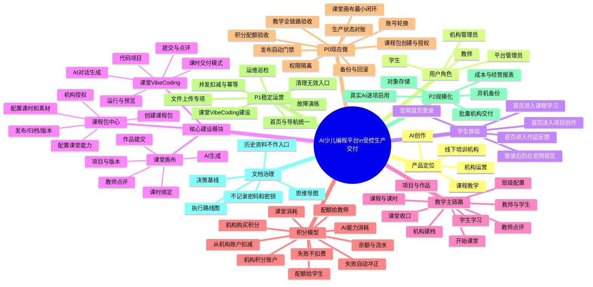

# AI 少儿编程平台｜思维导图


```mermaid
mindmap
  root((AI少儿编程平台\n受控生产交付))
    产品定位
      线下培训机构
      课程教学
      AI创作
      机构运营
    用户角色
      平台管理员
      机构管理员
      教师
      学生
    学生体验
      官网首页登录
      登录后仍在官网首页
      首页进入课程学习
      首页进入项目创作
      首页进入作品反馈
    核心建设模块
      课程包中心
        创建课程包
        配置课时和素材
        配置课堂能力
        发布/归档/版本
        机构授权
      课堂画布
        课时绑定
        项目与版本
        AI生成
        作品提交
        教师点评
      课堂VibeCoding
        课时交付模式
        代码项目
        AI对话生成
        运行与预览
        提交与点评
    教学主链路
      机构建档
      课程与课时
      教师与学生
      班级配置
      开始课堂
      学生学习
      项目与作品
      教师点评
      课堂收口
    积分模型
      机构购买积分
      机构积分账户
      配额给教师
      配额给学生
      课堂消耗
      AI能力消耗
      从机构账户扣减
      余额与流水
      失败不扣费
      失败自动冲正
    P0现在做
      课程包创建与授权
      课堂画布最小闭环
      生产状态对账
      账号轮换
      权限隔离
      积分配额验收
      教学全链路验收
      发布启动门禁
      备份与回滚
    P1稳定运营
      课堂VibeCoding建设
      首页与导航统一
      清理无效入口
      并发扣减与幂等
      文件上传专项
      故障演练
      运维巡检
    P2规模化
      批量机构交付
      异机备份
      对象存储
      真实AI逐项启用
      成本与经营报表
    文档治理
      决策基线
      执行路线图
      思维导图
      历史资料不作入口
      不记录密码和密钥
```

## 落地顺序

```text
官网首页登录落点
  → 课程包创建与配置
  → 机构授权课程包
  → 课堂画布最小闭环
  → 机构积分账户
  → 教师/学生配额
  → 上课消耗扣减
  → 用量流水对账
  → 课堂 VibeCoding 建设
  → 运维稳定化
  → 再考虑规模化能力
```
